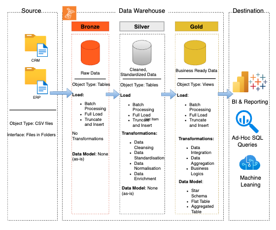

# Data Warehouse and Analytics Project

Welcome to the **Data Warehouse and Analytics Project** repository! 🚀  
This project demonstrates a comprehensive data warehousing and analytics solution, from building a data warehouse to generating actionable insights. Designed as a portfolio project, it highlights industry best practices in data engineering and analytics.

---
## 🏗️ Data Architecture

1. **Bronze Layer**: Stores raw data as-is from the source systems. Data is ingested from CSV Files into SQL Server Database.
2. **Silver Layer**: This layer includes data cleansing, standardization, and normalization processes to prepare data for analysis.
3. **Gold Layer**: Houses business-ready data modeled into a star schema required for reporting and analytics.

---
## 📖 Project Overview

This project involves:

1. **Data Architecture**: Designing a Modern Data Warehouse Using Medallion Architecture **Bronze**, **Silver**, and **Gold** layers.
2. **ETL Pipelines**: Extracting, transforming, and loading data from source systems into the warehouse.
3. **Data Modeling**: Developing fact and dimension tables optimized for analytical queries.
4. **Analytics & Reporting**: Creating SQL-based reports and dashboards for actionable insights.

🛡️ License
This project is licensed under the MIT License. You are free to use, modify, and share this project with proper attribution.

🌟 About Me
👋 Hi, I'm Rakesh Chary Bangaroj, a passionate Data Scientist and Machine Learning Engineer currently pursuing my Master of Science in Computer Science at the University of Houston. With a strong foundation in computer science and hands-on experience in both industry and research, I aim to solve complex problems using data-driven approaches and cutting-edge technologies.
